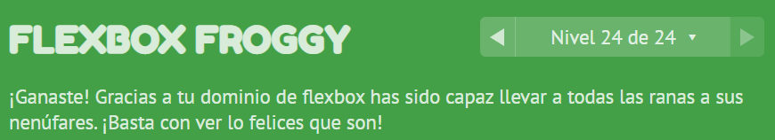
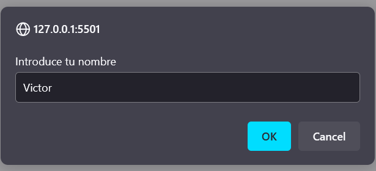

# 🎓Java BootCamp Projects🎓
Este repositorio contiene todos mis proyectos y temarios realizados durante mi bootcamp en Fundacio Esplai

<br/>

# 📋Indice
- [💭 Certificationes Azure](#💭-certificationes-azure)
    - [AZ-900](#az-900)
    - [DP-900](#az-900)
- [✴️ Regex](#✴️-regex) 
- [🗂️ ⬇️ Git & Markdown ](#🗂️-⬇️-git--markdown)
    - [Creacion de Repositorios](#creacion-de-repositorios)
    - [Guia de Git](#guia-de-git)
    - [Progate](#progate)
    - [Fast Forward or Not FF](#fast-forward-or-not-ff)
- [🏷️ 📘 HTML & CSS ](#🏷️-📘-html--css)
- [🅱️ Bootstrap](#🅱️-bootstrap)
- [🟨 🌀 Javascript & jQuery](#🟨-🌀-javascript--jquery)
- [🐬 MySQL](#🐬-mysql)
- [♨️ Java](#♨️-java)
- [🍃 Spring Boot](#🍃-spring-boot)
- [☢️ React](#☢️-react)

<br/>

<br/>

# 💭 Certificationes Azure 

## AZ-900


## DP-900


<br/>

## SC-900


<br/>

<br/>

# ✴️ Regex 

  
**1. Basándote en el fichero original, añade un “)” inmediatamente después del primer número del resultado debe ser el siguiente:**

  

  ```
  Capturamos los números que siguen de un espacio y mediante grupos capturamos los dígitos y los espacios en grupos distintos para incluir un corchete entre los dos grupos.
  ```

<br/>

**2. Basándote en el fichero original, haz que todos los elementos tengan un solo espacio entre palabra y palabra. Por tanto, es necesario quitar tabulaciones y doble espaciados. Además, también debes de seleccionar los espacios del final independientemente de si son tabulaciones o espacios.**

  

   ```
  Primeramente seleccionamos todos los espacios y los cambiamos por uno solo (\s+)
   ```
  

```
  Seguidamente seleccionamos solo los espacios al final de cada línea ($) y los cambiamos por un blank
```
<br/>

**3. Basándote en el fichero original, sustituye todos los subdominios de los correos que acaben en cl o ch por gmail (incluidos los que ya tengan dicha casuística):**


``` 
Para cambiar las terminaciones cl y ch tenemos que seleccionar con un | todos los matches que contengan .cl y .ch (.(cl|ch)).
Para seleccionar @algo utilizaremos (@(\w+)) para capturar las letras seguidas de un arroba.
Con los grupos definidos solo queda hacer la sustitución a @gmail$3 $3 correspondiente al grupo .(cl|ch) para mantener intactos los valores de ese grupo. (@(\w+))(.(cl|ch))
```

<br/>

**4. Elimina todo lo que no sea un email de cada una de las líneas:**


``` 
Para eliminar todos los elementos que no sean correos utilizamos este regex ([\w\sÍ].*?)([\w\.-]+@\w+\.\w{2,3})(.*) primero en el primer capture group seleccionamos todos los caracteres o dígitos previos al correo electrónico recopilando las palabras seguidas de un espacio o caracteres como í con acento.
 En el segundo capture agrupamos los nombres con puntos u otros caracteres especiales previamente al arroba y seguidos por cualquier letra que finaliza con las terminaciones .com .es etc. Y el último capture group representa los caracteres que siguen al correo. 
Definidos los grupos sustituimos toda la selección por solo el grupo que engloba el correo electrónico.
``` 

<br/>

**5. La compañía nos comenta que necesitamos pasar el fichero a un formato CSV. Ya que quieren poder abrir el fichero desde Excel por lo que tendremos que transformar el fichero a un formato CSV. Para ello, nos han pedido que no tenga espacios y que los elementos estén separados por puntos y comas:**


``` 
Primero seleccionamos el email y los espacios entre el inicio y el final para saber qué espacios pertenecen a los nombres compuestos como Ana Maria y saber dónde acaban y hacer que el siguiente paso de regex sea mucho más sencillo de elaborar
([\w\.-]+@\w+\.\w{2,3})
``` 
  

``` 
Seguidamente incluimos aquellos correos que no tengan la latencia o beneficiarios y incluimos ;; para que las columnas de nuestro csv coincidan.
(@\w+[\.\w+]+;)$
``` 
  

```
De esta manera seleccionamos solo los espacios detrás de un número seguidos del apellido y eliminamos los espacios por puntos y comas y mantenemos intactos los nombres compuestos.
(\d+) ([\w+\.]+)(\s)
```


```
Finalmente solo nos haría falta añadir puntos y comas a las personas que ya tengan benefactores y latencia en nuestro fichero de texto
([\d{2}s]);(\n)
```
  

```
Seleccionamos todos aquellos que acaban en una letra seguido de un salto de linia (aquellos que tienen latencia)
```
  

```
Finalmente tras arreglar algunos errores.Ya tenemos estandarizada nuestra cadena de datos
```
<br/>

<br/>

# 🗂️ ⬇️ Git & Markdown

## Creacion de Repositorios
Primeramente creamos un repositorio con el comando mkdir y accedemos a el
```shell
  mkdir repo01
  cd repo01/
  $git init
```
Hacemos el siguiente comando para inicializar el repositorio
```shell
  $git add readme.md
```

  
<br/>

```shell
  git status
  git commit -m "Creamos el fichero readme."
  git log
```

El fichero readme.md esta en un estado stage como si fuera memoria cache preparada para ser usada. Preparada para publicarla remotamente a la nube 

  
<br/>
<br/>

```shell
  git status
  git log
```  
  

<br/>

Con estos dos comandos vinculamos nuestro repositorio local al remoto que hemos creado en nuestra cuenta de GitHub
Y con el segundo añadimos todos los archivos staged a la rama primaria del repositorio master

```shell
  git remote add repo01 https://github.com/TekketsuDev/repo01.git
  git push --set-upstream repo01 master/main 
```
<br/>

Git remote -v muestra las URL que tienen conexion con nuestro repositorio local
```shell
  git remote -v
```


<br/>

Finalmente volvemos a hacer un commit y un push y quedan nuestros archivos actualizdos y docmuentados en GitHub


<br/>

## Guia de Git 

Creamos en GitHub el repositorio repo02

Clonamos el repositorio y seguidamente añadimos el origen remoto al repositorio y seteamos la rama principal en este caso main
```shell
  git clone https://github.com/TekketsuDev/repo02.git
  git remote add origin https://github.com/TekketsuDev/repo02.git
  git branch -M main
```
Actualizamos el repo02 de contenidos y repetimos el proceso de commit y push.


<br/>

## Progate

</br>

  

## Fast Forward or Not FF


## Git Alias


```
Creamos un alias para acortar comandos de git
```

<br/>

<br/>

# 🏷️ 📘 HTML & CSS

## **1. Como asociar un documento en CSS en un HTML**

```html
    1. <div style="holi">
    </div>

    <head>
    2. <style></style>
    </head>

    3.<link rel="stylesheet" href="./style.scss">
```
```css
    4. @import url("./style.scss")
```
<br/>

## **2. Input Css**


</br>

## **3. Flukeout selectores**


</br>

## **4. Toolness selectores**


</br>

## **5. 17selectores**


</br>

## **6. Peso selectores**

```css
^   !important -          0 0 0   (Prevalece por encima de cualquier selector)
|   #titulo               1 0 0 
|   .container href       0 1 1
|   h1                    0 1 0
|   .container            0 0 1
```

</br>

## **7. Columnas**


</br>

## **8. Bordes**


</br>

## **9. Text-align**


</br>

## **10. Border radius circular**


</br>

## **11. Overflow**


</br>

## **12. Outline**


</br>

## **13. Posicionando DIV's**


</br>

## **14. Diana**


</br>


## *15. Guernica*


</br>

## *15. FloatClear*


</br>

## *16. RGB*


</br>

## *17. FlexFroggy*



</br>

## *18. FlexFighther*


</br>

## *19. GridGarden*


</br>

## *20. GridLayout*


</br>

## *21. ColumnCard*


</br>

## *22. Spotify*


</br>

## *23. gridTestimonials*


</br>

## *24. Realbnb*


</br>


# 🅱️ Bootstrap

## *1. Media Querrys*


## *2. Replace Colors*


<br/>

## *3. Grid No Limit Width*


<br/>

## *4. Grid Limit Width*


<br/>

## *5. Grid Breakpoints*


<br/>

## *6. Grid Auto*

### *6.1*


### *6.2*


```
Se comporta como una columna normal hasta que llega al breakpoint lg y se estira tanto como puede pasando a la siguente fila
```
<br/>

## *7. Grid Positioning*

### *7.1*


### *7.2*


### *7.3 / 7.4 / 7.5*


<br/>

## *8. TablePos*


<br/>

## *9. Web Responsive*

### *XL/LG/MD Layout*


<br/>

### *SM Layout*


<br/>

### *XS Layout*


<br/>


# 🟨 🌀 Javascript & jQuery

## *1. typeData*



<br/>


<br/>

## *2. DefineData*


```javascript
Número (Number)

    // Declaración e inicialización de una variable numérica
    var numero = 10;
    console.log(numero); // Imprime el valor: 10
    console.log(typeof numero); // Imprime el tipo de dato: number

```	

```javascript
Cadena de caracteres (String)

// Declaración e inicialización de una variable de cadena de caracteres
var texto = "Hola, mundo!";
console.log(texto); // Imprime el valor: Hola, mundo!
console.log(typeof texto); // Imprime el tipo de dato: string
```	

```javascript
Booleano (Boolean)

// Declaración e inicialización de una variable booleana
var esVerdadero = true;
console.log(esVerdadero); // Imprime el valor: true
console.log(typeof esVerdadero); // Imprime el tipo de dato: boolean
```	

```javascript	
Arreglo (Array)

// Declaración e inicialización de un arreglo
var listaNumeros = [1, 2, 3, 4, 5];
console.log(listaNumeros); // Imprime el valor: [1, 2, 3, 4, 5]
console.log(typeof listaNumeros); // Imprime el tipo de dato: object (en JavaScript, los arreglos son objetos)
```	

```javascript	
Objeto (Object)

// Declaración e inicialización de un objeto
var datosPersona = { nombre: "Juan", edad: 30, ciudad: "Madrid" };
console.log(datosPersona); // Imprime el valor: { nombre: "Juan", edad: 30, ciudad: "Madrid" }
console.log(typeof datosPersona); // Imprime el tipo de dato: object


```	

```javascript	
Undefined

// Declaración de una variable sin inicializar
var variableSinValor;
console.log(variableSinValor); // Imprime el valor: undefined
console.log(typeof variableSinValor); // Imprime el tipo de dato: undefined


```	

```javascript	
Variable con scope local y global

// Declaración e inicialización de una variable con scope global
var variableGlobal = "Variable global";

function miFuncion() {
  // Declaración e inicialización de una variable con scope local
  var variableLocal = "Variable local";
  console.log(variableLocal); // Imprime el valor: Variable local
  console.log(variableGlobal); // Imprime el valor: Variable global
}

miFuncion();
console.log(variableGlobal); // Imprime el valor: Variable global
console.log(variableLocal); // Generará un error, ya que variableLocal está fuera del scope


```	

## *3. PrintData*


<br/>

## *4. MathRandom*


<br/>

## *5. returnData*


<br/>

## *6. Progate Javascript*


<br/>

## *7. SwitchCase Mes del Año*


<br/>


## *8. string Letter Replace*


<br/>


## *9. For And While*


<br/>


## *10. ForEach And Do While*


<br/>

## *11. Analize This Code*

```javascript
let numero = 1;
let i = 0;
do{
  if(i === 0){
    //Si el valor de i es igual a 0 aumentara el valor de i y reducira el numero de la variable numero. Finalmente imprimira el valor en consola
    i++;
    numero--;
    console.log(' holio' + numero);
    //Solo iterara una vez ya que el valor i se incrementa y no volvera a ser 0
  } else{
   //Si la condicion if no se cumple procedera a aumentar el valor del numero y printearlo en consola
    numero++;
    console.log(numero);
    //Itera 5 veces tantas como la condicion de do while exija
  }
} while (numero < 5);
```

<br/>

## *12. Array Methods*


<br/>

## *13. Array Items*


<br/>

## *14. Toggle Paragraph*


<br/>

## *15. Rock Papper Scissors*


<br/>

## *16. Calculator*


<br/>

<br/>

# 🐬 MySQL

## *1. Solution UML*


<br/>

<br/>

<br/>

# ♨️ Java

## *1. Escape Sequence*


<br/>

## *2. Suma*


<br/>

## *3. Type*


<br/>

## *4. Circular Range*


<br/>

## *5. All Range*


|   Nombre   |   Tipo    | Tamaño | Valor por Defecto |    Rango    |
|:----------:|:-----------------:|:------:|:-----------------:|:--------------------:|
|   boolean   |    Logico    | 1 bits | false |  0 (false) or 1 (true)        |
|   byte   |    Numero Entero   | 8 bits | 0 |  -128 to 127                  |
|   char   |    Caracter   | 16 bits | 0 |  ('\u0000') to 65535 ('\uffff')   |
|   short   |    Numero Entero   | 16 bits | 0 |       -32768 to 32767       |
|   int   |    Numero Entero   | 32 bits | 0 |  -2147483648 to 2147483647    |
|   long   |    Numero Entero   | 64 bits | 0l 0 0l |  -9223372036854775808 to 9223372036854775807    |
|   float   |    Numero Real   | 32 bits | 0.0f 0 0.0F |  0.14012985e-44 to 0.34028235e39    |
|   double   |    Numero Real   | 32 bits | 0.0d 0 0.0D |  4.94065645841246544e-324 to 1.79769313486231570e308    |


<br/>


<br/>

# 🍃 Spring Boot

<br/>

<br/>

# ☢️ React

